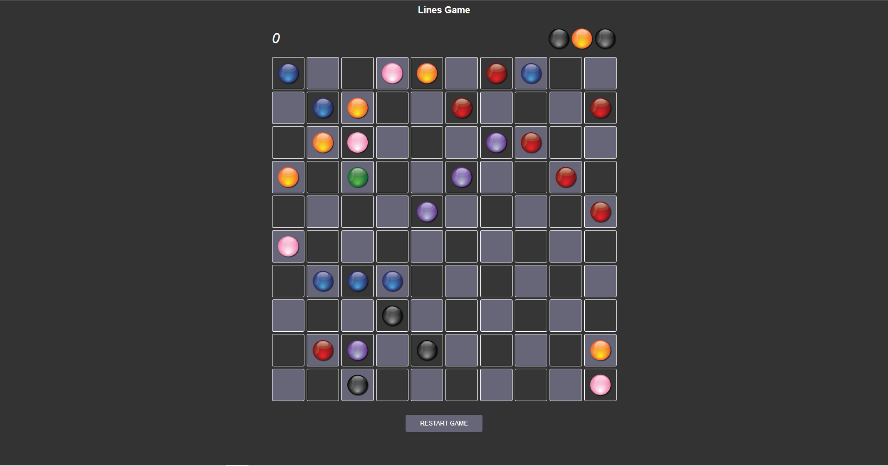

# Lines game clone

Check my <a href="https://ivanmpr.github.io/Lines-FULL/" target="_blank">Lines</a> game.
 
 
Rules: Make a line of 5 or more consecutive balls of the same color (in a row, column or diagonally),
in order to clear them of the board and earn points.
 
Click on the ball to select it, click on the desired field to move it.
 
If path creation between two fields is not possible, error message will be shown in UI, and fail sound will be played.
 
If there are no more empty fields on the board, game is over, so try to 'stay alive' as long as possible.
Enjoy!
 
 
I'm very proud for being able to present this fully functional game. I enjoyed worknig on it, especially because it forced me to learn couple new things and 
concepts in order to be able to complete it.
 
 
<a href="https://ivanmpr.github.io/Lines/" target="_blank">This</a> is where I was few weeks ago, without any knowledge about searching data problems and algorithyms. After some quality spent time, learning and understanding nodes, edges, trees, weighted and unweighted graphs, adjacency lists and other concepts, I managed to implement breadth first search and shortest path algorithym, necessary to finish this project.
 
 

 
